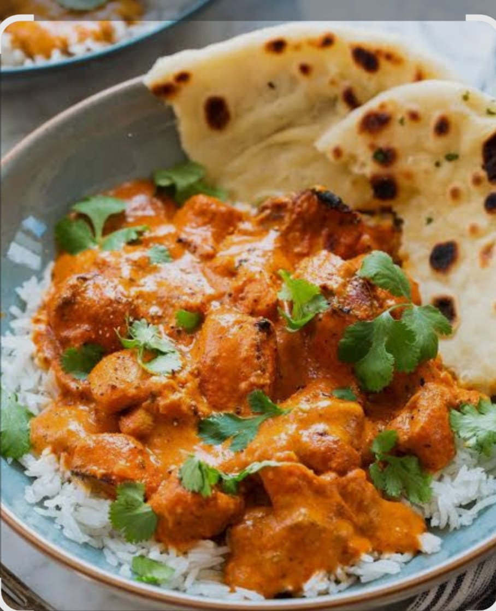
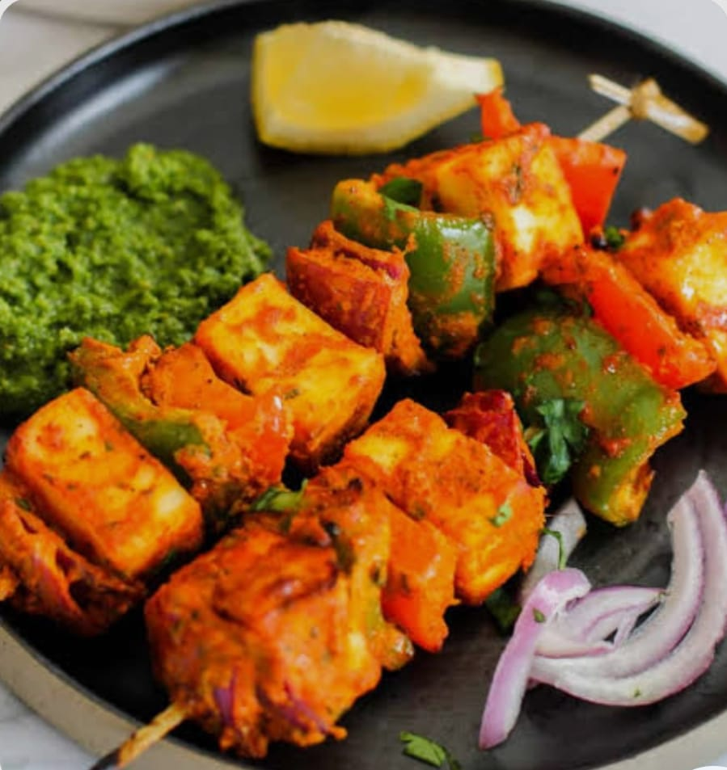

# Ex.07 Restaurant Website
## Date:8/10/25

## AIM:
To develop a static Restaurant website to display the food items and services provided by them.

## DESIGN STEPS:

### Step 1:
Requirement collection.

### Step 2:
Creating the layout using HTML and CSS.

### Step 3:
Updating the sample content.

### Step 4:
Choose the appropriate style and color scheme.

### Step 5:
Validate the layout in various browsers.

### Step 6:
Validate the HTML code.

### Step 7:
Publish the website in the given URL.

## PROGRAM:
```

rest.html
<html>
  <head>
    <title>
       YUMMIFY  
    </title>
    <link rel="stylesheet" href="style1.css">
  </head>
  <body>
      <div class="title">
         <p>YUMMIFY</p>
      </div>
      <div class="tight">
        <p>"We Yummify Your Cravings!"
           "We are delighted to welcome you to YUMMIFY hotel"
        </p>

      </div>
      <div class="google">
        <a href="rest.html">HOME</a>
        <a href="menu.html">MENU</a>
        <a href="admin.html">ADMIN</a>  
        <a href="contact.html">CONTACT</a>
      </div>
      <div class="footer">&copy;HARSHINI.J (25011612)</div>
  </body>
  </html>    

  style1.css
  body{
    background-image:url("WhatsApp Image 2025-10-07 at 8.04.10 PM.jpeg");
    background-repeat: no-repeat;
    background-size: cover;
    justify-content: space-between;
    display:flex;
}
.title{
    position: fixed;
    top:0;
    font-family:'Franklin Gothic Medium', 'Arial Narrow', Arial, sans-serif;
    margin-left: 60px;
    font-size: 50px;
    font-weight: bolder;
    color:rgb(198, 21, 148);
}
.tight{
    position:fixed;
    bottom:500px;
    margin-left: 5px;
    font-family:'Times New Roman', Times, serif;
    font-weight: bolder;
    font-size:35px;
    color:rgb(45, 5, 226);
}
.google{
    position:fixed;
    top:0;
    @media(any-hover: hover){
        a:hover{
            background-color: rgb(164, 24, 136);

        }
    }
    margin-top: 40px;
    margin-left: 1055px;
    margin-right: 50px;
    font-family:' Arial', 'Helvetica',' sans-serif';
    font-size:22px;
}
.footer{
    position: fixed;
    bottom:0%;
    width: 100%;
    background-color:rgb(87, 45, 149);
    color:rgb(43, 177, 177);
    text-align: center;
    padding:10px;
}

menu.html
<html>
    <head>
        <title>
            Menu: Ceremony
        </title>
        <link rel="stylesheet" href="style2.css">
    <body>
        <div class="link">
            <a href="rest.html">Home</a>
            <a href="menu.html">Menu</a>
            <a href="admin.html">Administer</a>
            <a href="contact.html">Contact-us</a>
        </div>
        <div class="title">
            <p>Yummy menu</p>
        </div>
        <div class="menu-grid">
            <div class="menu-item">
                
                <h3>Hot& Tangy Noodles-Rs.199</h3>
            </div>
            <div class="menu-item">
                
                <h3>tandoori treat platter-Rs.260</h3>
            </div>
            <div class="menu-item">
                
                <h3>Pop panner balls-Rs.299</h3>
            </div>
            <div class="menu-item">
                
                <h3>Yummify nacho boms-Rs.169</h3>
            </div>
            <div class="menu-item">
                
                <h3>faloda-Rs.189</h3>
            </div>
            <div class="menu-item">
                
                <h3>Spicy tornado rolls-Rs.150</h3>
            </div>
            <div class="menu-item">
                
                <h3>Spring potato-rs.120</h3>
            </div>
            <div class="menu-item">
                
                <h3>butter chicken-rs.250</h3>
            </div>
            <div class="menu-item">
                
                <h3>Tandoori momos-Rs.130</h3>
            </div>
            <div class="menu-item">
                
                <h3>Masala fries-Rs.70</h3>
            </div>
            <div class="menu-item">
                
                <h3>samosa tacos-Rs.180</h3>
            </div>
            <div class="menu-item">
                
                <h3>panner tikka-Rs.210</h3>
            </div>
        </div>
<div class="footer">&copy; Harshini(25011612)</div>
    </body>
</html>

style2.css

body{
    background-image: url('WhatsApp Image 2025-10-07 at 1.34.57 PM.jpeg');
    background-repeat: no-repeat;
    background-size: cover;
    justify-content: space-between;
    display: flex;
    

}
.title{
    position: relative;
    top:0;
    font-family:'Segoe UI', 'Tahoma', 'Geneva', 'Verdana', 'sans-serif';
    margin-left: 5px;
    font-size:60px;
    font-weight: bolder;
    color:rgb(109,27,43);
}
.link{
    position: fixed;
    top:0;
    @media(any-hover: hover){
        a:hover{
            background-color: rgb(123,70,78);

        }
    }
    margin-top: 10px;
    margin-left: 1000px; 
    margin-right: 60px;
    font-family:'Verdana', 'Geneva', 'Tahoma';
    font-size: 22px;
}
.menu-grid{
    align-items: center;
    display: grid;
    grid-template-columns: repeat(6,1fr);
    gap: 9px;
    padding:19px;
    background-size: 80%;
    background-color: rgba(180, 11, 45, 0.5);
}
.menu-item {
    background-color: rgba(66, 50, 213, 0.51);
    background-size: 700px;
    padding: 1px;
    border-radius: 5px;
    text-align: center;
    border: 2px solid #460814;
}
.menu-item img{
    
    width: 100%;
    height: auto;
    border-radius:4px;
    margin-bottom:5px;
}
.menu-item h3{
    margin: 0;
    font-size: 20px;
    color:greenyellow;
}
.footer{
    position: fixed;
    bottom: 0;
    width: 100%;
    background-color: rgb(120,30,41);
    color: red;
    text-align: center;
    padding: 10px;
}

admin.html

<html>
    <head> 
        <title>
            ADMINISTRATOR: YUMMIFY
        </title>
        <link rel="stylesheet" href="style3.css">
    </head>
    <body>
        <div class="link">
            <a href="rest.html">HOME</a>
            <a href="menu.html">MENU</a>
            <a href="admin.html">ADMIN</a>
            <a href="contact.html">CONTACT</a>
        </div>
        
        <div class="title">
            <p>YUMMIFY-MY YUMMIFY SQUAD</p>
        </div>
        <div class="team-grid">
            <div class="team-item">
                
                <h2>Harshini.J</h2>
                <p>CEO</p>
            </div>
        <div class="team-item">
            
            <h2>Matheesha</h2>
            <p>Head chef</p>
        </div>
        <div class="team-item">
            
            <h2>Vijay</h2>
            <p>Manager</p>
        </div>
        <div class="team-item">
            
            <h2>Nazriya</h2>
            <p>supervisor</p>
        </div>
        <div class="team-item">
            
            <h2>Sai pallavi</h2>
            <p>Executive chef</p>
        </div>
        <div class="team-item">
            
            <h2>Jeevi prakash</h2> 
            <p>HR manager</p>
        </div>
    </div>
        
      <div class="footer">&copy; HARSHINI.J(25011612)</div>  
    </body>
</html>

style3.css

body{
    background-image: url("WhatsApp Image 2025-10-07 at 8.18.48 PM.jpeg");
    background-repeat: no-repeat;
    background-size: cover;
    justify-content: space-between;
    display: flex;
    
}
.title{
    position: absolute;
    top:10;
    font-family:'Lucida Sans', 'Lucida Sans Regular', 'Lucida Grande', 'Lucida Sans Unicode',' Geneva';
    margin-left: 50px;
    font-size:50px;
    font-weight: bold;
    color:rgb(109,25,42)

}
.link{
     position: fixed;
     top:0;
     @media(any-hover: hover){
        a:hover{
          background-color: rgb(123,70,70);
    }
}
margin-top: 40px;
margin-left: 1040px;
margin-right: 50px;
font-family: 'Lucida Sans','Lucida Sans Regular','Lucida Grande','Lucida Sans Unicode',Geneva';
font-size: 22px;
}
.team-grid{
    /* align-items: center; */
    bottom:0;
    display: grid;
    grid-template-columns: repeat(6, 1fr);
    gap: 30px;
    padding:40px;
    max-width: 1200px;
    margin:0 auto;
}
.team-item {
    background-color: rgba(216,52,52,0.41);
    background-size: 200px;
    border-radius: 5px;
    text-align: center;
    border: 2px solid green ;
    margin-top: 200px;
    height: 250px;
}
.team-item img{
    width: 120px;
    height: auto;
    border-radius 50%;
    border: 3px solid rgb(223,65,100);
    margin-bottom: 20px;
    margin-left: auto;
    margin-right: auto;

}
.team-item h2{
    margin: 0;
    font-size: 20px;
    color: rgb(50,3,7);
}
.team-item p{ 
    margin: 0;
    font-size:20px;
    color:rgb(140,0,20)
}
.footer{
    position: fixed;
    bottom: 0;
    width: 100%; 
    background-color: rgb(120,30,45)
    color: pink;
    text-align: center;
    padding: 10px;
}


contact.html

<html>
    <head>
        <title>
            CONTACT: YUMMIFY
        </title>
        <link rel="stylesheet" href="style4.css">
    </head>
    <body>
        <div class="link">
            <a href="rest.html">HOME</a>
            <a href="menu.html">MENU</a>
            <a href="admin.html">ADMIN</a> 
            <a href="contact.html">CONTACT</a>   
        </div>
        <div class="title">
            <p>YUMMIFY</p>
        </div>
        <div class="supply">
           <h2>CONTACT</h2>
           <p>Visit Our YUMMIFY At</p>
           <p>NO.12,Anna salai,Mount road,chennai</p>
           <p>Phone:+91 7845917063</p>
           <P>Email: yummify@gmail.com</P>
        </div>
        <div class="footer">&copy; HARSHINI.J(25011612)</div>
    </body>
</html>

style4.css

body{
    background-image: url('WhatsApp Image 2025-10-07 at 7.38.30 PM.jpeg');
    background-repeat: no-repeat;
    background-size: cover;
    justify-content: space-between;
    display: flex;
    align-items: center;

}
.title{
    position: absolute;
    top: 10px;
    font-family:'Franklin Gothic Medium', 'Arial Narrow', Arial, sans-serif;
    margin-left:5px;
    font-size:40px;
    font-weight:bolder;
    color:brown;
}
.link{
    position: fixed;
    top:0;
    @media(any-hover: hover){
        a:hover{
            background-color:palevioletred;
        }
    }
    
    margin-top: 50px;
    margin-left: 1040px;
    margin-right: 50px;
    font-family:'Lucida Sans','Lucida Sand Regular','Lucida Grande';
    font-size:22px;
}
.supply{
    margin-right:1000px;
    border: 8px violet;
    background-color: green;
    width:500px;
    height:500px;
    text-align:center;
    padding:20px;
}
.supply h2{
    font-size: 35px;
    color:brown;

}
.supply p{
    font-size: larger;
    color:darkcyan;
}

.footer{
    position: fixed;
    bottom: 0;
    width: 100%;
    background-color:brown;
    color:aliceblue;
    text-align: center;
    padding: 10px;
}

```

## OUTPUT:


## RESULT:
The program for designing software company website using HTML and CSS is completed successfully.
